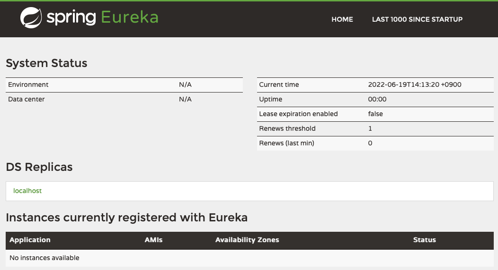

 

# Service Discovery (Eureka Server) 
 

## Eureka Server 설정 
application.yml 파일을 아래와 같이 설정한다.  
~~~
server:
  port: 8761

spring:
  application:
    name: discoveryservice

eureka:
  client:
    register-with-eureka: false 
        # => 서버로만 실행되는 역할이기 때문에 자기 자신은 유레카에 등록하지 않도록 한다. 
    fetch-registry: false
        # => Eureka 서버로부터 인스턴스들의 정보를 주기적으로 가져올 것인지를 설정하는 속성. 
~~~

http://localhost:8761 로 접속하면 System Status를 확인할 수 있다.  

 

    

